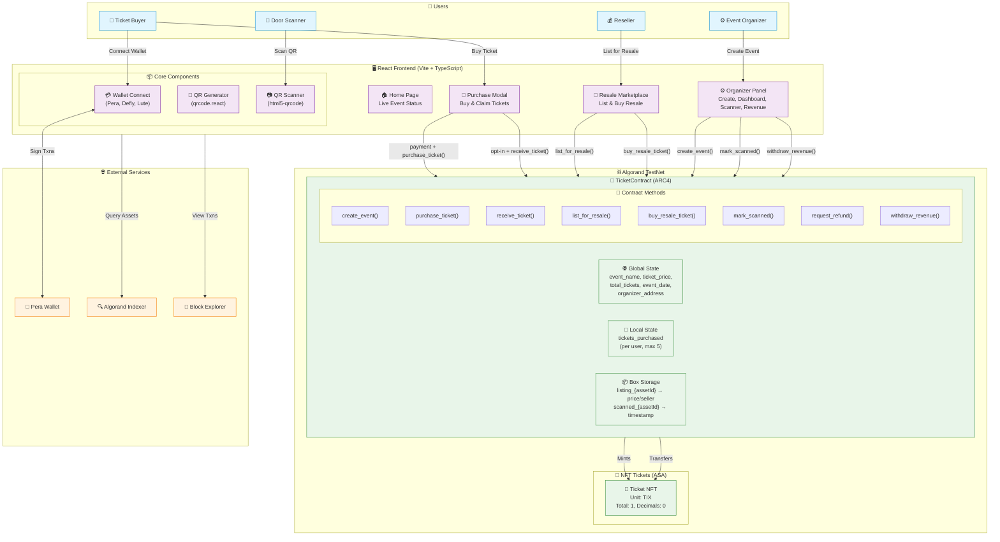
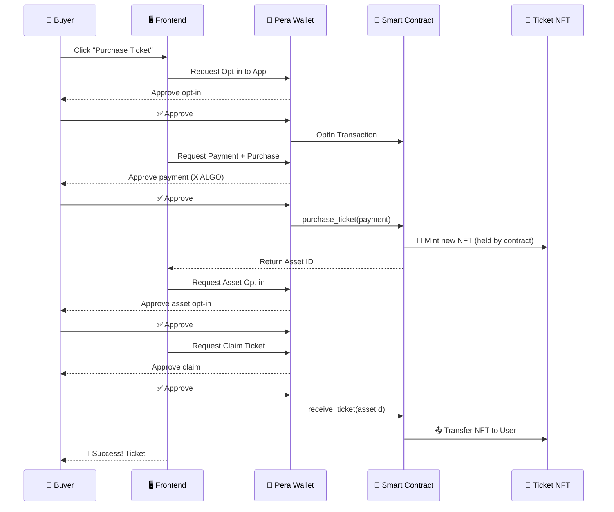
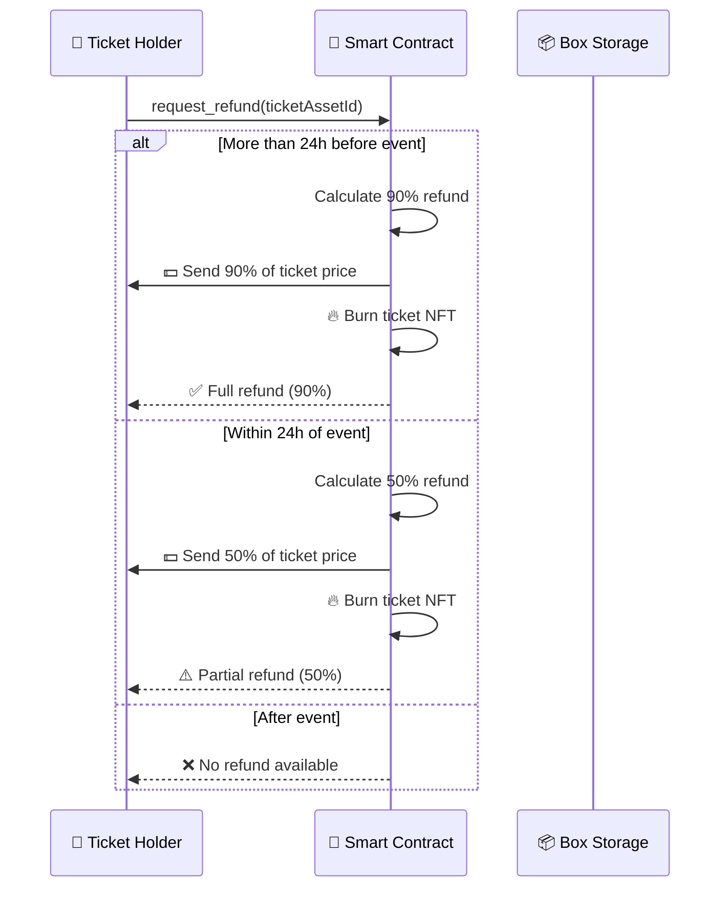
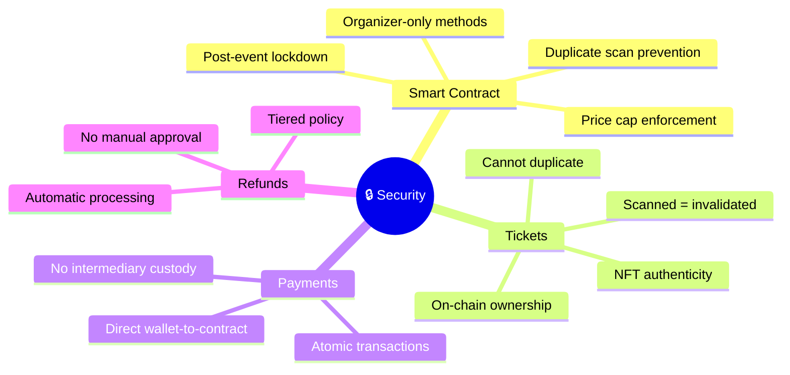

# TicketChain Architecture

## 🏗️ System Architecture Diagram



---

## 🔄 Transaction Flow Diagrams

### 1. Ticket Purchase Flow



### 2. Resale Flow

```mermaid
sequenceDiagram
    participant Seller as 💰 Seller
    participant Buyer as 🎫 Buyer
    participant Contract as 📜 Smart Contract
    participant Box as 📦 Box Storage

    Note over Seller: Owns Ticket NFT
    
    Seller->>Contract: list_for_resale(assetId, price)
    Contract->>Box: Store listing_{assetId}
    Contract-->>Seller: ✅ Listed
    
    Note over Buyer: Sees listing in marketplace
    
    Buyer->>Contract: opt-in to asset
    Buyer->>Contract: buy_resale_ticket(payment, assetId)
    Contract->>Contract: Verify price ≤ max resale
    Contract->>Contract: Calculate royalty (10%)
    Contract->>Seller: 💵 Send 90% to seller
    Contract->>Contract: 💰 Keep 10% royalty
    Contract->>Buyer: 🎫 Transfer NFT
    Contract->>Box: Delete listing_{assetId}
    Contract-->>Buyer: ✅ Purchase complete
```

### 3. Refund Flow



---

## 📊 Data Model

### Global State (On-Chain)
| Key | Type | Description |
|-----|------|-------------|
| `event_name` | String | Name of the event |
| `total_tickets` | UInt64 | Maximum ticket capacity |
| `tickets_sold` | UInt64 | Number of tickets sold |
| `ticket_price` | UInt64 | Price in microAlgos |
| `max_resale_price` | UInt64 | Maximum resale price allowed |
| `organizer_royalty` | UInt64 | Royalty percentage (0-50) |
| `organizer_address` | Address | Organizer wallet address |
| `event_date` | UInt64 | Unix timestamp of event |
| `refund_deadline` | UInt64 | 24h before event (auto-calculated) |
| `event_location` | String | Event venue location |
| `total_primary_revenue` | UInt64 | Total from primary sales |
| `total_resale_revenue` | UInt64 | Total from resale royalties |
| `total_refunded` | UInt64 | Total refunds paid out |

### Local State (Per User)
| Key | Type | Description |
|-----|------|-------------|
| `tickets_purchased` | UInt64 | Count of tickets bought (max 5) |

### Box Storage
| Key Pattern | Value | Description |
|-------------|-------|-------------|
| `listing_{assetId}` | 48 bytes | Seller address (32) + Price (8) + ListTime (8) |
| `scanned_{assetId}` | 8 bytes | Scan timestamp |

---

## 🛡️ Security Features



---

## 🏛️ Technology Stack

| Layer | Technology | Purpose |
|-------|------------|---------|
| **Blockchain** | Algorand TestNet | Fast, low-cost L1 |
| **Smart Contract** | Python (AlgoPy) → TEAL | ARC4 ABI compliant |
| **Client Generator** | AlgoKit 5.0 | TypeScript client from ARC56 |
| **Frontend** | React 18 + TypeScript | Modern UI |
| **Build Tool** | Vite 5.4 | Fast HMR development |
| **Styling** | TailwindCSS + DaisyUI | Beautiful components |
| **Wallet** | @txnlab/use-wallet-react | Multi-wallet support |
| **QR Codes** | qrcode.react + html5-qrcode | Generate & scan |
| **State** | React useState + localStorage | Simple persistence |

